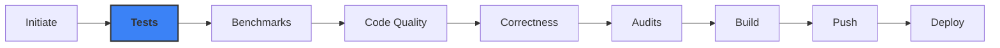
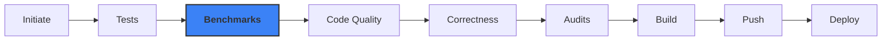
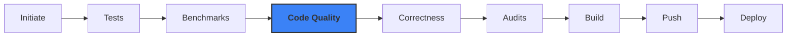
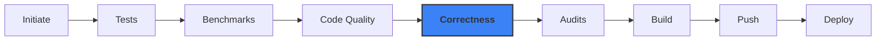

<style>
/* Make scrollable code blocks start at the top */
.slidev-code-wrapper {
  align-items: flex-start !important;
}

.slidev-code-wrapper pre {
  scroll-behavior: auto !important;
}
</style>

# CI/CD: Managing Change

---

# Who am I?

I'm Jacob! Some people call me dino.

<br>

**Some things I do:**

<v-click>

- Software Engineer at CarbinX Technologies
- CTO at Annona
- Part of a systems research group at UofA

</v-click>

<br>

**Where you can find me:**

<v-click>

- On github as [jdeinum](https://github.com/jdeinum)
- On discord as deinum#4841
- On [nullspaces.io](https://nullspaces.io/blog)

</v-click>

---

# What is CI/CD?

CI/CD are a set of practices that help streamline application deployment

<br>

<v-click>

**Continuous Integration** → Pushing changes into the main branch frequently

</v-click>

<br>

<v-click>

**Continuous Delivery** → Production software artifacts are built continuously

</v-click>

<br>

<v-click>

**Continuous Deployment** → Production software artifacts are deployed to your runtime continuously

</v-click>

---

# Why Do We Need It?

Deploying code that **doesn't change** is easy.

<br>

Deploying code that **changes** is hard:

<v-click>

- Maintaining correctness
- Maintaining non-functional requirements
- Maintaining code quality
- Meeting SLAs / SLOs
- Ensuring deployability


</v-click>

---

# Taking a Simple App to Production

## Goals

<v-click>

- Ensure correctness
- Ensure non-functional requirements
- Ensure proper code quality

</v-click>

## Non-Goals

<v-click>

- Setting up all of the infrastructure

</v-click>

<br>

<v-click>

We'll focus on the **pipeline**, not the platform.

</v-click>

---

# Environment Setup

## We will be using:

<v-click>

- Axum for our http application
- Git repository for code
- k3d for local Kubernetes
- ArgoCD for GitOps deployments

</v-click>

---

# Pushing Changes to Main

We gotta have something to deploy ¯\\_(ツ)_/¯

<br>

<v-click>

## The Golden Rule

</v-click>

<v-click>

**Always** have a working version of the application in main.

</v-click>

<v-click>

<br>
<br>
<br>

This lets us fork from main without fear!

</v-click>

---

# Pushing Changes to Main

## Semantic Versioning

<br>

<v-click>

**1 in 6** of the top 1000 crates has violated semver at least once! <span class="citation"><a href="/sources">[1]</a></span>

</v-click>

<br>

<v-click>

[Conventional commits](https://www.conventionalcommits.org/) help:

- Automate version bumping
- Generate changelogs
- Prevent accidental breaking changes

</v-click>

---

# Pushing Changes to Main

Tools of Interest:

<v-click>

- git / [jj](https://github.com/martinvonz/jj) - Version control

</v-click>

---


# Initiating the Pipeline

How do we trigger a release?

<v-click>

- Manual git tag
- Release PR
- Push to master

</v-click>

---


# Initiating the Pipeline

Tools of Interest:

<v-click>

- [release-plz](https://github.com/release-plz/release-plz) - Automated releases
- [cargo-semver-checks](https://github.com/obi1kenobi/cargo-semver-checks) - Semver linting

</v-click>

---



# Tests

Each testing strategy lies somewhere on a **scope** and **purity** grid.

<v-click>

- Unit tests
- Invariant testing
- Snapshot testing
- Property testing
- Contract based testing
- Integration tests

</v-click>

---


# Tests

Why testing might be worthwhile.

**NIST (2002):** <span class="citation"><a href="/sources">[2]</a></span>

<v-click>

- Software bugs cost the U.S. economy **$59.5 billion/year**
- Over **1/3** of this cost (~$22B) could be avoided with better testing
- ~80% of development costs go to identifying and correcting defects

</v-click>

**CISQ (2020):** <span class="citation"><a href="/sources">[3]</a></span>

<v-click>

- Updated estimate: **$2.08 trillion** in costs from poor software quality (US only)

</v-click>

---


# Tests

## [Apple goto fail](https://dwheeler.com/essays/apple-goto-fail.html) (2014) <span class="citation"><a href="/sources">[4]</a></span>

Duplicate line broke SSL verification for 18 months. A single unit test would have caught it.

## [Knight Capital](https://www.henricodolfing.com/2019/06/project-failure-case-study-knight-capital.html) (2012) <span class="citation"><a href="/sources">[5]</a></span>

Lost **$440 million in 45 minutes**. Old test code accidentally deployed to production.

---


# Tests

Testing is non trivial.

```rust
#[test]
fn test_is_even() {
    assert!(is_even(2))
}
```

<br>
<br>
<v-click>

It appears correct, although it could just be:

```rust
fn is_even(number: u32) -> bool {
    return true
}
```

</v-click>

---


# Tests

Some lessons:

<v-click>

- Ensure you have atleast 1 test per group in your input (even/odd in our case)
- Always check error conditions
- Use code coverage tools

</v-click>

---


# Tests

Tools of Interest:

<v-click>

- [cargo-mutants](https://github.com/sourcefrog/cargo-mutants) - Mutation testing
- [quickcheck](https://github.com/BurntSushi/quickcheck) / [proptest](https://github.com/proptest-rs/proptest) - Property testing
- [kani](https://github.com/model-checking/kani) - Exhaustive verification
- [insta](https://github.com/mitsuhiko/insta) - Snapshot testing
- [wiremock](https://github.com/LukeMathWalker/wiremock-rs) - HTTP mocking
- [nextest](https://github.com/nextest-rs/nextest) - Fast test runner
- [codecov](https://github.com/codecov/codecov-action) - Code coverage

</v-click>

---



# Benchmarks

If you thought testing was hard, I have some bad news for you.

<v-click>


</v-click>

---


# Benchmarks

```rust
use std::time::SystemTime;

let start = SystemTime::now();

FunctionThatNormallyTakes100SecondsToRun();

let time_in_seconds = start.elapsed();

println!("Function took {} seconds", elapsed.as_secs());
```

Seems pretty reasonable...

---


# Benchmarks

<div class="grid grid-cols-2 gap-4">
  <v-click>
    
  </v-click>
  <v-click>
    <div>
      
      <div class="absolute bottom-10 left-10 text-2xl font-bold">
        You've done it!
      </div>
    </div>
  </v-click>
</div>

---


# Benchmarks

```rust{all|1}
use std::time::SystemTime;

let start = SystemTime::now();

FunctionThatNormallyTakes100SecondsToRun();

let time_in_seconds = start.elapsed();

println!("Function took {} seconds", elapsed.as_secs());
```

<v-click>

Not **monotonic**, NTP can step your clock back!

</v-click>

---


# Benchmarks

<br>
<br>

Let's fix that

````md magic-move
```rust
use std::time::SystemTime;

let start = SystemTime::now();

FunctionThatNormallyTakes100SecondsToRun();

let time_in_seconds = start.elapsed();

println!("Function took {} seconds", elapsed.as_secs());
```

```rust
use std::time::Instant; // instant is monotonic, phew!

let start = Instant::now();

FunctionThatNormallyTakes100SecondsToRun();

let time_in_seconds = start.elapsed();

println!("Function took {} seconds", elapsed.as_secs());
```
````

---


# Benchmarks

```rust
use std::time::Instant;

let start = Instant::now();

FunctionThatNormallyTakes100SecondsToRun();

let time_in_seconds = start.elapsed();

println!("Function took {} seconds", elapsed.as_secs());
```

Now we get consistent benchmark times right?

---


# Challenges in benchmarking

How do we know:

<v-click>

- We get the same CPU share time
- The system didn't pause to reap memory
- There are no cache coherence problems
- Other programs aren't flooding the TLB
- We're measuring goodput accurately

</v-click>

---


# Benchmarks

Example GitHub Actions job

```yaml {*}{maxHeight:'350px'}
- name: Benchmark HTTP endpoints
  run: |
    # Start server in background
    cargo run --release &
    SERVER_PID=$!
    # Wait for server to be ready
    sleep 2
    # Run oha and extract p99.9 latency
    LATENCY=$(oha -m POST -q 10000 -c 1000 \
      -A 'application/json' -d '{"number": 42}' \
      'http://localhost:8000/even_checker' \
      -H 'Content-Type: application/json' \
      --no-tui --output-format json | jq '.latencyPercentiles["p99.9"]')
    # Stop server
    kill $SERVER_PID
    # Check latency threshold (e.g., < 50ms)
    if (( $(echo "$LATENCY > 0.05" | bc -l) )); then
      echo "Latency too high: ${LATENCY}s (threshold: 50ms)"
      exit 1
    fi
```

<br>

---


# Benchmarks

Tools of Interest:

<v-click>

- [criterion](https://github.com/bheisler/criterion.rs) - Statistical benchmarking
- [hyperfine](https://github.com/sharkdp/hyperfine) - CLI benchmarking
- [divan](https://github.com/nvzqz/divan) - Fast benchmarking
- [iai-callgrind](https://github.com/iai-callgrind/iai-callgrind) - Instruction-level benchmarks
- [oha](https://github.com/hatoo/oha) - HTTP load testing
- [tango](https://github.com/bazhenov/tango) - Paired benchmarking framework

</v-click>

---



# Code Quality Checks

The anti-entropy systems

<v-click>

Everyone has different coding styles. On bigger projects, we use tools to ensure a standard everyone abides by.

</v-click>

---


# Code Quality Checks

Tools of Interest:

<v-click>

- [rustfmt](https://rust-lang.github.io/rustfmt/) - Consistent formatting
- [clippy](https://doc.rust-lang.org/clippy/) - Best practices and common pitfalls
- [cargo-machete](https://github.com/bnjbvr/cargo-machete) - Find unused dependencies

</v-click>

---



# Correctness Checks

Concurrent systems are hard.

<v-click>


</v-click>

<br>

<v-click>

Adding checks in your CI/CD pipeline helps catch undefined behavior before it lands in deployment.

</v-click>

---

```mermaid
flowchart LR
    A[Initiate] --> B[Tests]
    B --> C[Benchmarks]
    C --> D[Code Quality]
    D --> E[Correctness]:::current
    E --> F[Audits]
    F --> G[Build]
    G --> H[Push]
    H --> I[Deploy]
    classDef current fill:#3b82f6,stroke:#333,stroke-width:2px,font-weight:bold
```

# Correctness Checks

Tools of Interest:

<v-click>

- [Miri](https://github.com/rust-lang/miri) - Detect undefined behavior
- [Shuttle](https://github.com/awslabs/shuttle) / [Loom](https://github.com/tokio-rs/loom) - Concurrency testing
- [Turmoil](https://github.com/tokio-rs/turmoil) - Network simulation

</v-click>

---

```mermaid
flowchart LR
    A[Initiate] --> B[Tests]
    B --> C[Benchmarks]
    C --> D[Code Quality]
    D --> E[Correctness]
    E --> F[Audits]:::current
    F --> G[Build]
    G --> H[Push]
    H --> I[Deploy]
    classDef current fill:#3b82f6,stroke:#333,stroke-width:2px,font-weight:bold
```

# Audits

Who wants to deploy unsafe code?

<v-click>

Audit tools help capture:

- **CVEs** - XZ Utils backdoor (2024) nearly compromised millions of Linux systems <span class="citation"><a href="/sources">[6]</a></span>
- **Unmaintained repos** - Log4j remains 13% vulnerable 3 years after Log4Shell <span class="citation"><a href="/sources">[7]</a></span>
- **License issues** - Redis license change (2024) sparked community fork and trust erosion <span class="citation"><a href="/sources">[8]</a></span>

</v-click>

<br>
<br>

<v-click>

We don't need to run this on every push - only when dependencies change or weekly.

</v-click>

---

```mermaid
flowchart LR
    A[Initiate] --> B[Tests]
    B --> C[Benchmarks]
    C --> D[Code Quality]
    D --> E[Correctness]
    E --> F[Audits]:::current
    F --> G[Build]
    G --> H[Push]
    H --> I[Deploy]
    classDef current fill:#3b82f6,stroke:#333,stroke-width:2px,font-weight:bold
```

# Audits

Tools of Interest:

<v-click>

- [cargo-deny](https://github.com/EmbarkStudios/cargo-deny) - Lint dependencies for security, licenses, sources
- [cargo-vet](https://github.com/mozilla/cargo-vet) - Supply chain security
- [cargo-audit](https://github.com/rustsec/rustsec/tree/main/cargo-audit) - Known vulnerability detection

</v-click>

---

```mermaid
flowchart LR
    A[Initiate] --> B[Tests]
    B --> C[Benchmarks]
    C --> D[Code Quality]
    D --> E[Correctness]
    E --> F[Audits]
    F --> G[Build]:::current
    G --> H[Push]
    H --> I[Deploy]
    classDef current fill:#3b82f6,stroke:#333,stroke-width:2px,font-weight:bold
```

# Building

Now that we have validated source code, we can build.

<v-click>

**Key questions:**

- Where will the code run? (Container runtime, WASM runtime, target platform)
- What resources will it have access to? (Embedded devices need special care)
- How do we attach context? (SBOMs, provenance data)

</v-click>

---

```mermaid
flowchart LR
    A[Initiate] --> B[Tests]
    B --> C[Benchmarks]
    C --> D[Code Quality]
    D --> E[Correctness]
    E --> F[Audits]
    F --> G[Build]:::current
    G --> H[Push]
    H --> I[Deploy]
    classDef current fill:#3b82f6,stroke:#333,stroke-width:2px,font-weight:bold
```

# Building

Tools of Interest:

<v-click>

- [docker buildx](https://docs.docker.com/build/buildx/) - Multi-platform builds
- [nix](https://nixos.org/) - Reproducible builds
- [cargo-auditable](https://github.com/rust-secure-code/cargo-auditable) - Embed dependency info in binary

</v-click>

---

```mermaid
flowchart LR
    A[Initiate] --> B[Tests]
    B --> C[Benchmarks]
    C --> D[Code Quality]
    D --> E[Correctness]
    E --> F[Audits]
    F --> G[Build]
    G --> H[Push]:::current
    H --> I[Deploy]
    classDef current fill:#3b82f6,stroke:#333,stroke-width:2px,font-weight:bold
```

# Pushing

Now we need to store our built artifacts somewhere.

<v-click>

<br>

**Recommendations:**

- Upload to both cloud registry and local registry
- Local images let you run scanning tools without cost concerns

</v-click>

<br>
<br>
<br>

<v-click>

**Make sure your registry entries are immutable!**

</v-click>

---

```mermaid
flowchart LR
    A[Initiate] --> B[Tests]
    B --> C[Benchmarks]
    C --> D[Code Quality]
    D --> E[Correctness]
    E --> F[Audits]
    F --> G[Build]
    G --> H[Push]
    H --> I[Deploy]:::current
    classDef current fill:#3b82f6,stroke:#333,stroke-width:2px,font-weight:bold
```

# Deploying

How do we know something new is available?

<v-click>

Pull-based tooling monitors container registries and automatically detects new versions.

</v-click>

---

```mermaid
flowchart LR
    A[Initiate] --> B[Tests]
    B --> C[Benchmarks]
    C --> D[Code Quality]
    D --> E[Correctness]
    E --> F[Audits]
    F --> G[Build]
    G --> H[Push]
    H --> I[Deploy]:::current
    classDef current fill:#3b82f6,stroke:#333,stroke-width:2px,font-weight:bold
```

# Deploying

Tools of Interest:

<v-click>

- [ArgoCD Image Updater](https://argocd-image-updater.readthedocs.io/) - Automatically update container images in ArgoCD applications
- [Flux Image Automation](https://fluxcd.io/flux/guides/image-update/) - GitOps-native image updates
- [Renovate](https://docs.renovatebot.com/) - Automated dependency updates including container images
- [Dependabot](https://docs.github.com/en/code-security/dependabot) - GitHub-native updates for images in workflows and manifests
- [Keel](https://keel.sh/) - Kubernetes deployment automation

</v-click>

---

```mermaid
flowchart LR
    A[Initiate] --> B[Tests]
    B --> C[Benchmarks]
    C --> D[Code Quality]
    D --> E[Correctness]
    E --> F[Audits]
    F --> G[Build]
    G --> H[Push]
    H --> I[Deploy]:::current
    classDef current fill:#3b82f6,stroke:#333,stroke-width:2px,font-weight:bold
```

# Deploying

Updating manifests: GitOps vs full sending

<v-click>

**GitOps method:**

- Built-in audit log of deployment upgrades
- Git is the source of truth
- Changes reviewed via PR

</v-click>

<v-click>

**Direct modification:**

- Maximum agility
- Can get audit info earlier in pipeline
- Updates applied immediately to main

</v-click>

---

```mermaid
flowchart LR
    A[Initiate] --> B[Tests]
    B --> C[Benchmarks]
    C --> D[Code Quality]
    D --> E[Correctness]
    E --> F[Audits]
    F --> G[Build]
    G --> H[Push]
    H --> I[Deploy]:::current
    classDef current fill:#3b82f6,stroke:#333,stroke-width:2px,font-weight:bold
```

# Deploying

ArgoCD Application manifests comparison:

<v-click>

<div class="grid grid-cols-2 gap-4">

<div>

**GitOps (image-updates branch + PR)**

```yaml {*}{maxHeight:'300px'}
apiVersion: argoproj.io/v1alpha1
kind: Application
metadata:
  name: my-app
spec:
  source:
    repoURL: https://github.com/org/repo
    targetRevision: image-updates
    path: manifests
  destination:
    server: https://kubernetes.default.svc
    namespace: production
```

</div>

<div>

**Direct apply to master**

```yaml {*}{maxHeight:'300px'}
apiVersion: argoproj.io/v1alpha1
kind: Application
metadata:
  name: my-app
spec:
  source:
    repoURL: https://github.com/org/repo
    targetRevision: master
    path: manifests
  destination:
    server: https://kubernetes.default.svc
    namespace: production
```

</div>

</div>

</v-click>

---

# We've done it!

<v-click>

<div class="flex items-center justify-center h-full">

We took most of the uncertainty out of our new code, without needing to enter a single command (other than initiating the pipeline)

</div>

</v-click>

---

# Thanks!

---

# Questions?

---

# Sources

[1] [SemVer in Rust: Breakage, Tooling, and Edge Cases](https://predr.ag/blog/semver-in-rust-tooling-breakage-and-edge-cases/) - FOSDEM 2024

[2] [The Economic Impacts of Inadequate Infrastructure for Software Testing](https://www.nist.gov/document/report02-3pdf) - NIST 2002

[3] [The Cost of Poor Software Quality in the US: A 2020 Report](https://www.it-cisq.org/the-cost-of-poor-software-quality-in-the-us-a-2020-report/) - CISQ 2020

[4] [The Apple goto fail vulnerability: lessons learned](https://dwheeler.com/essays/apple-goto-fail.html) - David Wheeler

[5] [Project Failure Case Study: Knight Capital](https://www.henricodolfing.com/2019/06/project-failure-case-study-knight-capital.html) - Henrico Dolfing

[6] [From Log4j to XZ Utils: The Escalating Crisis of Open-Source Vulnerabilities](https://checkmarx.com/learn/sca/from-log4j-to-xz-utils-the-escalating-crisis-of-open-source-vulnerabilities/) - Checkmarx 2024

[7] [2024 State of the Software Supply Chain](https://www.sonatype.com/state-of-the-software-supply-chain/introduction) - Sonatype 2024

[8] [Redis tightens its license terms, pleasing no one](https://www.theregister.com/2024/03/22/redis_changes_license/) - The Register 2024
